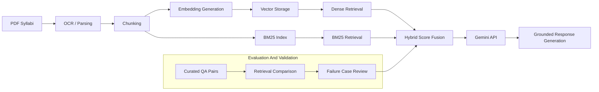

# Course Recommendation Platform

A production-oriented hybrid retrieval system and grounded RAG chatbot for university syllabus search. The goal is reliable, traceable answers backed by retrieved syllabus evidence rather than a demo chatbot.

## 🔄 Workflow Status

[](https://github.com/YOUR_USERNAME/course-platform/actions/workflows/ci.yml)
[](https://github.com/YOUR_USERNAME/course-platform/actions/workflows/deploy.yml)

**CI/CD Pipeline**: Tests run on every commit. Auto-deployment on Production branch push. [Learn more →](CI_CD_WORKFLOWS.md)

<table>
  <tr>
    <td align="center">
      
      <br />
      <em>Light Home Page</em>
    </td>
    <td align="center">
      
      <br />
      <em>Dark Home Page</em>
    </td>
  </tr>
</table>

## Goals And Reliability Focus

- Grounded retrieval and responses backed by syllabus evidence
- Retrieval reliability with hybrid scoring and evaluation-driven changes
- Validation mindset: measurable failure modes and mitigations
- Production-oriented architecture with traceability and observability hooks

## Key Capabilities

- **Hybrid Retrieval**: BM25 + dense retrieval with score fusion (see [HYBRID_SEARCH_IMPLEMENTATION.md](HYBRID_SEARCH_IMPLEMENTATION.md))
- **Grounded RAG Chatbot**: Gemini responses constrained to retrieved syllabus context
- **PDF Ingestion Pipeline**: OCR, parsing, chunking, and indexing
- **Search API**: FastAPI endpoints for search and ingestion
- **Reliability-first Design**: Explicit failure analysis and evaluation artifacts
- **Dockerized Deployment**: Single compose for backend, search, and frontend

## Architecture



## Validation And Evaluation

This repository includes lightweight, manual evaluation assets focused on retrieval reliability and grounded responses:

- Curated QA pairs used as ground truth for retrieval checks: [evaluation/qa_pairs.json](evaluation/qa_pairs.json)
- Retrieval comparison notes for BM25 vs dense vs hybrid: [evaluation/benchmark_results.md](evaluation/benchmark_results.md)
- Documented failure cases with mitigations: [evaluation/failure_cases.md](evaluation/failure_cases.md)

Evaluation is intentionally qualitative to avoid misleading claims. The goal is repeatable, transparent validation, not benchmark marketing.

## Retrieval Strategy

- **BM25** provides robust keyword coverage for course codes, titles, and structured fields.
- **Dense retrieval** supports semantic similarity for natural language intent.
- **Hybrid fusion** balances exact matching with semantic recall for stable ranking.
- **Grounded responses** cite retrieved syllabus content rather than model priors.

## Failure Analysis

See [evaluation/failure_cases.md](evaluation/failure_cases.md) for realistic failure modes and mitigation strategies. These cases drive changes in parsing, chunking, retrieval fusion, and prompt constraints.

## Current Limitations

- OCR dependency and variable PDF quality can degrade retrieval accuracy.
- Ranking instability across similar queries when documents are inconsistent.
- Semantic ambiguity for short or underspecified queries.
- Retrieval quality is bounded by syllabus coverage and formatting consistency.
- Context window limits constrain how much evidence can be grounded per response.

## Future Improvements

- Reranking and cross-encoder verification for higher precision.
- Automated retrieval evaluation jobs with regression tracking.
- Observability dashboards for retrieval quality, latency, and error rates.
- Response quality metrics tied to grounded evidence spans.
- Query rewriting and caching for stable performance.
- Retrieval monitoring to detect drift and data quality issues.

## 📋 Prerequisites

- Python 3.10+
- Meilisearch server (v1.0+)
- Docker and Docker Compose (optional, for containerized deployment)

## 🛠️ Installation

### 1. Clone the Repository

```bash
git clone <repository-url>
cd Project
```

### 2. Create Virtual Environment

```bash
python -m venv .venv

# Windows
.venv\Scripts\activate

# Linux/Mac
source .venv/bin/activate
```

### 3. Install Dependencies

```bash
pip install -r Requirements.txt
```

### 4. Set Up Environment Variables

Copy the example environment file and configure it:

```bash
cp .env.example .env
```

Edit `.env` with your settings:

```env
MEILISEARCH_URL=http://localhost:7700
MEILISEARCH_MASTER_KEY=your_master_key_here
RESOURCES_PATH=./Resources
```

### 5. Start Meilisearch

#### Using Docker:

```bash
docker run -d -p 7700:7700 \
  -e MEILI_MASTER_KEY=your_master_key_here \
  -v $(pwd)/meili_data:/meili_data \
  getmeili/meilisearch:v1.6
```

#### Using Docker Compose:

```bash
docker-compose up -d
```

## 🚀 Running The Application

### Development Mode

```bash
python -m app.main
```

Or with uvicorn directly:

```bash
uvicorn app.main:app --reload --host 0.0.0.0 --port 8000
```

### Production Mode

```bash
uvicorn app.main:app --host 0.0.0.0 --port 8000 --workers 4
```

The API will be available at:
- API: http://localhost:8000
- Interactive Docs: http://localhost:8000/docs
- ReDoc: http://localhost:8000/redoc

## 📁 Project Structure

```
Project/
├── app/
│   ├── __init__.py
│   ├── main.py                  # FastAPI application entry point
│   ├── api/
│   │   ├── __init__.py
│   │   └── endpoints/
│   │       ├── __init__.py
│   │       └── courses.py       # Course API endpoints
│   ├── core/
│   │   ├── __init__.py
│   │   └── config.py            # Configuration and settings
│   ├── models/
│   │   ├── __init__.py
│   │   └── course.py            # Pydantic models
│   ├── services/
│   │   ├── __init__.py
│   │   ├── search_service.py    # Meilisearch integration
│   │   └── ingest_service.py    # PDF parsing and indexing
│   └── utils/
│       ├── __init__.py
│       └── text_processing.py   # Text cleaning utilities
├── Resources/                    # Place PDF syllabus files here
├── .env                         # Environment variables (create from .env.example)
├── .env.example                 # Environment variables template
├── .gitignore                   # Git ignore rules
├── docker-compose.yml           # Docker Compose configuration
├── Requirements.txt             # Python dependencies
└── README.md                    # This file
```

## 📚 API Endpoints

### Health Check
```http
GET /api/v1/health
```
Check the health status of the application and Meilisearch connection.

### Search Courses
```http
GET /api/v1/search?q=web backend development&limit=20&semantic_ratio=0.5
```
Search for courses based on a query string with hybrid search (keyword + semantic).

**Query Parameters:**
- `q` (required): Search query
- `limit` (optional): Number of results (1-100, default: 20)
- `offset` (optional): Pagination offset (default: 0)
- `course_code` (optional): Filter by specific course code
- `semantic_ratio` (optional): Balance between keyword (0.0) and semantic (1.0) search (default: 0.5)

**Semantic Ratio Guide:**
- `0.0`: Pure keyword search (exact term matching)
- `0.5`: Balanced hybrid search (recommended)
- `1.0`: Pure semantic search (meaning-based)

**Example Response:**
```json
{
  "query": "web backend development",
  "hits": [
    {
      "id": "a1b2c3d4e5f6",
      "course_code": "CS301",
      "title": "Web Backend Development",
      "summary": "Learn to build scalable web backends...",
      "score": 0.95
    }
  ],
  "total": 1,
  "limit": 20,
  "offset": 0,
  "processing_time_ms": 12
}
```

### Ingest PDFs
```http
POST /api/v1/ingest?force_reindex=false
```
Parse and index all PDF files from the Resources directory.

**Query Parameters:**
- `force_reindex` (optional): Delete existing documents before ingesting (default: false)

**Example Response:**
```json
{
  "status": "success",
  "message": "Ingestion completed. 10 documents indexed.",
  "total_files": 10,
  "processed_files": 10,
  "indexed_documents": 10,
  "failed_files": []
}
```

### Index Statistics
```http
GET /api/v1/index/stats
```
Get statistics about the Meilisearch index.

### Delete All Documents
```http
DELETE /api/v1/index/documents
```
Delete all documents from the search index.

## 🎯 Usage Workflow

### 1. Add PDF Syllabi

Place your PDF syllabus files in the `Resources/` directory:

```
Resources/
├── CS101_Introduction_to_Programming.pdf
├── CS301_Web_Backend_Development.pdf
└── MATH201_Calculus_II.pdf
```

### 2. Ingest Data

Call the ingestion endpoint to parse and index the PDFs:

```bash
curl -X POST "http://localhost:8000/api/v1/ingest"
```

Or use the interactive docs at http://localhost:8000/docs

### 3. Search Courses

Search for courses using natural language queries:

```bash
curl "http://localhost:8000/api/v1/search?q=learn%20web%20backend&limit=10"
```

## 🔧 Configuration

### Environment Variables

| Variable | Description | Default |
|----------|-------------|---------|
| `APP_NAME` | Application name | "Course Recommendation Platform" |
| `APP_VERSION` | Application version | "1.0.0" |
| `DEBUG` | Debug mode | false |
| `HOST` | Server host | 0.0.0.0 |
| `PORT` | Server port | 8000 |
| `CORS_ORIGINS` | Allowed CORS origins | http://localhost:3000,http://localhost:5173 |
| `MEILISEARCH_URL` | Meilisearch server URL | http://localhost:7700 |
| `MEILISEARCH_MASTER_KEY` | Meilisearch master key | "" |
| `MEILISEARCH_INDEX_NAME` | Index name for courses | "courses" |
| `RESOURCES_PATH` | Path to PDF files | ./Resources |
| `BATCH_SIZE` | Batch size for indexing | 100 |
| `SEARCH_LIMIT` | Default search results limit | 20 |

### Meilisearch Configuration

The application automatically configures Meilisearch with optimal settings:

- **Searchable Attributes**: title, course_code, summary, content
- **Ranking Rules**: words, typo, proximity, attribute, sort, exactness
- **Typo Tolerance**: Enabled with configurable thresholds
- **Filterable Attributes**: course_code

## 🐳 Docker Deployment

The project includes a `docker-compose.yml` file for easy deployment:

```yaml
services:
  meilisearch:
    image: getmeili/meilisearch:v1.6
    ports:
      - "7700:7700"
    environment:
      - MEILI_MASTER_KEY=your_master_key_here
    volumes:
      - ./meili_data:/meili_data
```

Start services:

```bash
docker-compose up -d
```

## 🧪 Testing

Test the API using curl, Postman, or the interactive docs:

### Test Health Check
```bash
curl http://localhost:8000/api/v1/health
```

### Test Search
```bash
curl "http://localhost:8000/api/v1/search?q=programming&limit=5"
```

## 🔍 Search Features

### Typo Tolerance
The search engine automatically handles typos in queries:
- "progamming" → "programming"
- "backedn" → "backend"

### Relevance Ranking
Results are ranked based on:
1. Number of matched query terms
2. Typo distance
3. Proximity of terms
4. Attribute weight (title > summary > content)
5. Exactness of match

### Natural Language Queries
Users can search using natural language:
- "I want to learn web backend development"
- "courses about machine learning"
- "database management"

## 📝 Data Schema

Each course document in Meilisearch has the following structure:

```json
{
  "id": "unique_hash",
  "course_code": "CS301",
  "title": "Web Backend Development",
  "content": "Full course content for search...",
  "summary": "Brief course description..."
}
```

## 🤝 Frontend Integration

The API is CORS-enabled and ready for frontend integration. Example fetch request:

```javascript
// Search for courses
const response = await fetch(
  'http://localhost:8000/api/v1/search?q=web+backend&limit=10'
);
const data = await response.json();
console.log(data.hits);

// Ingest PDFs
const ingestResponse = await fetch(
  'http://localhost:8000/api/v1/ingest',
  { method: 'POST' }
);
const ingestData = await ingestResponse.json();
```

## � AWS EC2 Deployment with GitHub Actions

### CI/CD Pipeline Overview
- **CI (Continuous Integration)**: Tests run automatically on every commit to any branch
- **CD (Continuous Deployment)**: Auto-deployment only when pushing to `Production` branch

See [CI_CD_WORKFLOWS.md](CI_CD_WORKFLOWS.md) for detailed workflow documentation.

### Quick Start
For automated deployment to AWS EC2 using GitHub Actions CI/CD pipeline:

1. **Read the full guide**: See [DEPLOYMENT.md](DEPLOYMENT.md) for comprehensive setup instructions
2. **Quick steps**:
   - Launch Ubuntu 22.04 LTS EC2 instance
   - SSH and run setup script: `curl -fsSL https://raw.githubusercontent.com/YOUR_USERNAME/course-platform/Production/scripts/ec2-setup.sh | bash`
   - Add GitHub secrets: `EC2_HOST`, `EC2_USER`, `EC2_PRIVATE_KEY`
   - Create `Production` branch and push to trigger automatic deployment

### Features
- ✅ Automated tests on every commit (CI)
- ✅ Automated deployment on `Production` branch push (CD)
- ✅ Docker multi-container orchestration
- ✅ Health check validation
- ✅ Optional Slack notifications
- ✅ SSH-based secure deployment
- ✅ Rollback capability
- ✅ Backend + Frontend test coverage

### Files
- [.github/workflows/deploy.yml](.github/workflows/deploy.yml) - GitHub Actions workflow
- [scripts/ec2-setup.sh](scripts/ec2-setup.sh) - EC2 initialization script
- [scripts/health-check.sh](scripts/health-check.sh) - Health check utility
- [DEPLOYMENT.md](DEPLOYMENT.md) - Complete setup guide

## �🐛 Troubleshooting

### Meilisearch Connection Failed
- Ensure Meilisearch is running: `docker ps`
- Check the `MEILISEARCH_URL` in `.env`
- Verify the `MEILISEARCH_MASTER_KEY` is correct

### No PDF Files Found
- Verify PDFs are in the `Resources/` directory
- Check the `RESOURCES_PATH` in `.env`
- Ensure file extensions are `.pdf`

### Import Errors
- Activate the virtual environment
- Reinstall dependencies: `pip install -r Requirements.txt`

## 📄 License

This project is created for educational purposes as part of a University Information Retrieval project.

## 👥 Contributing

Contributions are welcome! Please follow these steps:
1. Fork the repository
2. Create a feature branch
3. Commit your changes
4. Push to the branch
5. Open a Pull Request

## 📧 Support

For questions or issues, please open an issue on the repository.
