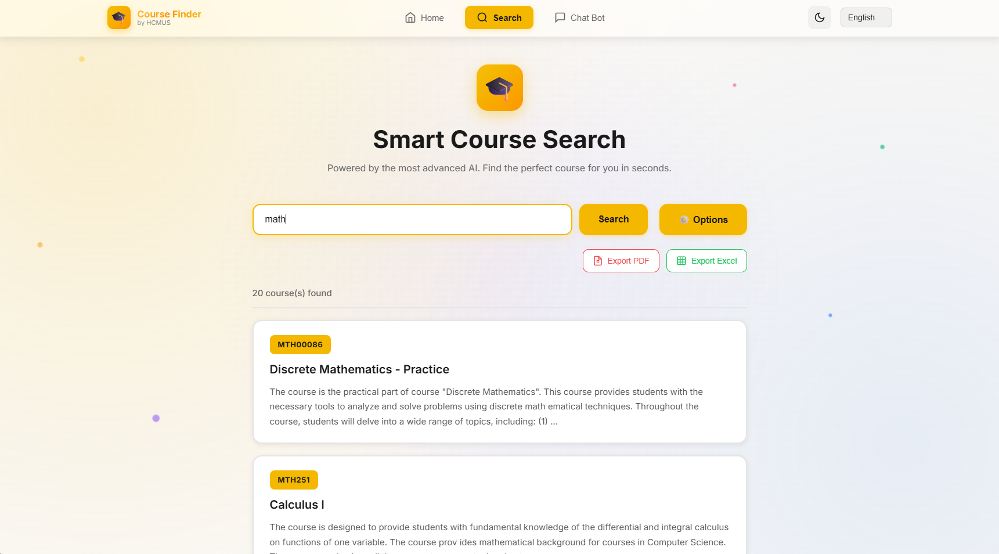
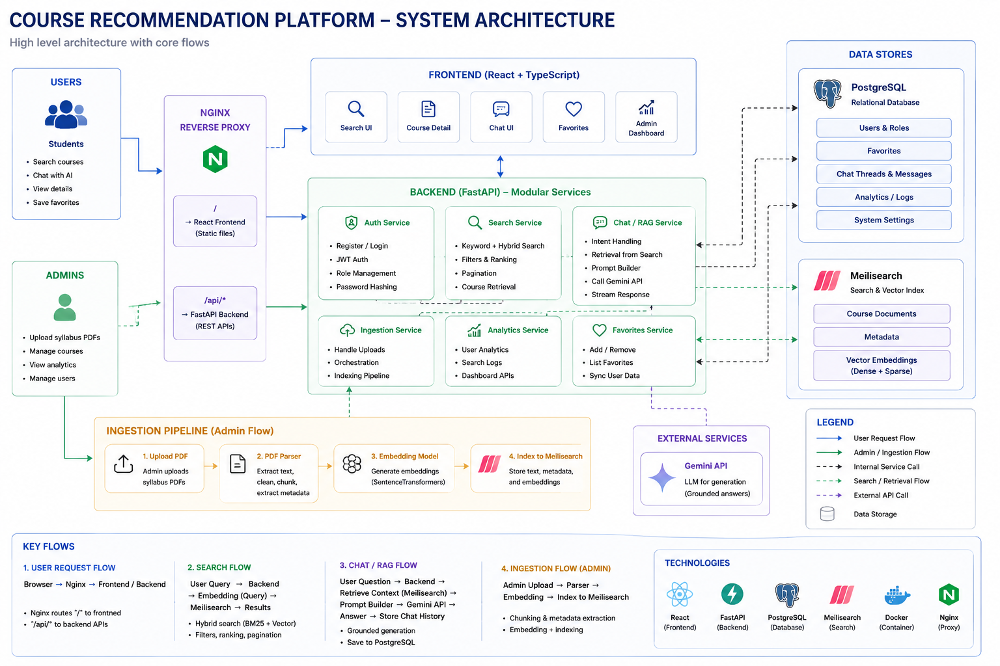
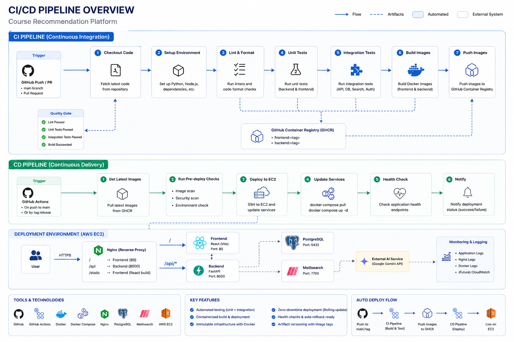

# Course Recommendation Platform

A full-stack course discovery system that turns syllabus PDFs into searchable course knowledge. The platform combines PDF ingestion, hybrid retrieval, user accounts, favorites, admin tools, and a grounded RAG chatbot for course Q&A.

## Highlights

- Hybrid course search with Meilisearch keyword ranking and dense embeddings.
- Gemini-powered RAG chat grounded in retrieved syllabus context.
- PDF ingestion pipeline for extracting, cleaning, embedding, and indexing course data.
- Authentication, admin dashboard, saved favorites, chat history, and usage analytics.
- Dockerized deployment with GitHub Actions, GHCR images, and AWS EC2 support.

## Screenshots

<table>
  <tr>
    <td align="center">
      
      <br />
      <em>Light mode</em>
    </td>
    <td align="center">
      
      <br />
      <em>Dark mode</em>
    </td>
  </tr>
</table>

## Architecture

<p align="center">
  
</p>

## Tech Stack

| Layer | Technologies |
| --- | --- |
| Frontend | React, TypeScript, Vite, Vitest, jsPDF, XLSX |
| Backend | FastAPI, Pydantic, Uvicorn, python-jose, passlib/bcrypt |
| Retrieval | Meilisearch, BM25-style lexical search, SentenceTransformers embeddings |
| AI | Google Gemini API, grounded RAG prompt pipeline |
| Data | PostgreSQL in production, SQLite fallback for local development |
| DevOps | Docker, Docker Compose, nginx, GitHub Actions, GHCR, AWS EC2 |

## Core Workflow

1. Admin uploads or places syllabus PDFs in `Resources/`.
2. Backend extracts and cleans PDF text.
3. Course records are parsed from the document content.
4. Embeddings are generated with `all-MiniLM-L6-v2`.
5. Documents are indexed into Meilisearch.
6. Users search courses or ask questions through the RAG chatbot.

## API Overview

| Purpose | Endpoint |
| --- | --- |
| Health check | `GET /api/v1/health` |
| Search courses | `GET /api/v1/search?q=...&semantic_ratio=0.5` |
| Suggestions | `GET /api/v1/suggestions?q=...` |
| Course detail | `GET /api/v1/courses/{id}` |
| Register/login | `POST /api/v1/auth/register`, `POST /api/v1/auth/login` |
| Favorites | `GET/POST/DELETE /api/v1/favorites` |
| Chat | `POST /api/v1/chat` |
| Chat threads | `GET/POST /api/v1/chat/threads` |
| Ingest PDFs | `POST /api/v1/ingest` |
| Admin files/stats | `GET /api/v1/admin/files`, `GET /api/v1/admin/stats` |

Interactive API docs are available at `/docs` when the backend is running.

## Local Development

### Prerequisites

- Python 3.10+
- Node.js 18+
- Docker and Docker Compose

### Environment

```bash
cp .env.example .env
```

Minimum values to review:

```env
MEILISEARCH_MASTER_KEY=your_master_key_here
MEILI_MASTER_KEY=your_master_key_here
GEMINI_API_KEY=your_gemini_api_key_here
JWT_SECRET=change-me-in-production
ADMIN_EMAIL=admin@example.com
ADMIN_PASSWORD=change-me
```

### Run With Docker Compose

```bash
docker compose --env-file .env.development -f docker-compose.yml -f docker-compose.dev.yml up --build
```

Useful URLs:

- Frontend: `http://localhost:3000`
- Backend API: `http://localhost:8000`
- API docs: `http://localhost:8000/docs`
- Meilisearch: `http://localhost:7700`

### Run Tests

```bash
python -m pytest -v tests/
cd frontend && npm test
```

## Production Deployment

Production uses prebuilt GHCR images and `docker-compose.prod.yml` on EC2.

```bash
IMAGE_PREFIX=ghcr.io/<github-owner> IMAGE_TAG=latest \
docker compose --env-file .env -f docker-compose.prod.yml pull

IMAGE_PREFIX=ghcr.io/<github-owner> IMAGE_TAG=latest \
docker compose --env-file .env -f docker-compose.prod.yml up -d
```

For a versioned release, use a Git tag image:

```bash
IMAGE_PREFIX=ghcr.io/<github-owner> IMAGE_TAG=v1.0.0 \
docker compose --env-file .env -f docker-compose.prod.yml up -d
```

Production notes:

- Keep production secrets in the EC2 `.env` file, not in Git.
- Public traffic should enter through nginx on port `80` or `443`.
- PostgreSQL and Meilisearch should remain private to the Docker network.
- Verify deployment with `curl http://localhost/api/v1/health`.

## CI/CD

<p align="center">
  
</p>

GitHub Actions builds and tests the project, then publishes Docker images to GHCR. Pushing to the `production` branch publishes `latest`; pushing a Git tag such as `v1.0.0` publishes images with that tag and deploys the matching version.

Images:

- `ghcr.io/<owner>/course-backend:<tag>`
- `ghcr.io/<owner>/course-frontend:<tag>`
- `ghcr.io/<owner>/backend-deps:<tag>`

## Project Structure

```text
app/                    FastAPI backend
app/api/endpoints/      Auth, course, search, chat, admin routes
app/services/           Search, ingestion, chat, auth, analytics services
frontend/               React + Vite frontend
Resources/              Source PDFs for ingestion
evaluation/             Retrieval notes and failure analysis
Figures/                README and presentation images
nginx/                  Reverse proxy config
scripts/                EC2 setup and helper scripts
tests/                  Backend and integration tests
.github/workflows/      CI/CD workflows
```

## Current Limitations

- PDF parsing quality depends on source formatting and scan quality.
- Hybrid search still requires tuning for ambiguous queries.
- RAG answers are limited by retrieved evidence quality.
- HTTPS/domain setup is deployment-specific and should be finalized per environment.
- Strong production secrets, restricted CORS, and locked-down ports are required before public use.

## Roadmap

- Add evidence citations in chat responses.
- Add reranking for higher precision retrieval.
- Improve OCR/layout handling for scanned PDFs.
- Add automated retrieval regression tests.
- Add monitoring for latency, errors, and search quality.

## License

This project was built for educational and demonstration purposes as part of an Information Retrieval project.
